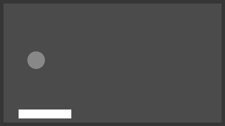

# RLGameBox
A collection of reinforcement learning games created using godot and godot-rl-agents.

Note: This project has recently switched from pygame to godot so older versions of games have been canceled.

## Games
### In Progress
- 2D Soccer (1v1)
- BallHopper 
### BallHopper

BallHopper is a very simple singleplayer pong alike, used as a test example.  
The agent has a single continues action with which it can control
its x velocity and the goal of the game is to keep the ball above the ground.  



## How to use

To use this project first create a python venv.  

Then install all requirements using:  
```pip install -r requirements.text```

There are already build executivables present for each finished game, simply run these if you want to play them yourself.

If you want to use or train a model to control an agent, use one of the provided train and test scripts in ```scripts/```.

## Author
Created by Sjoegd

